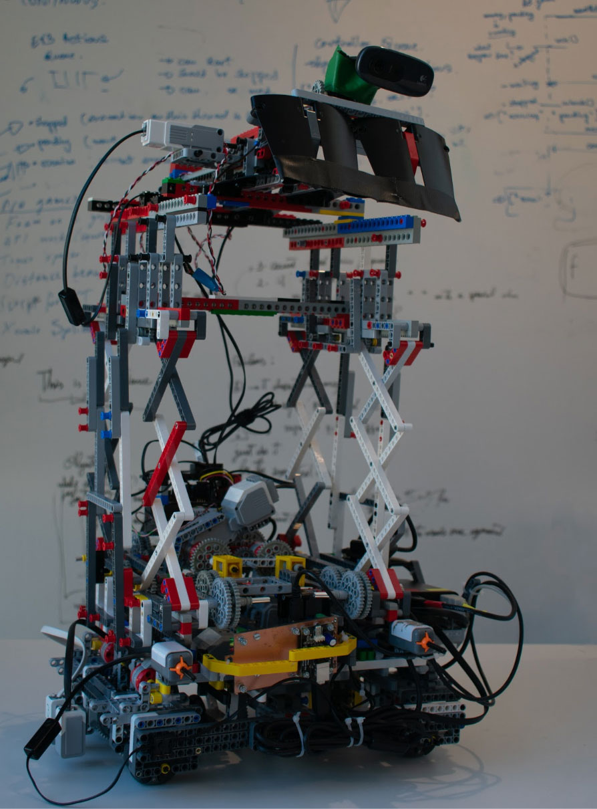
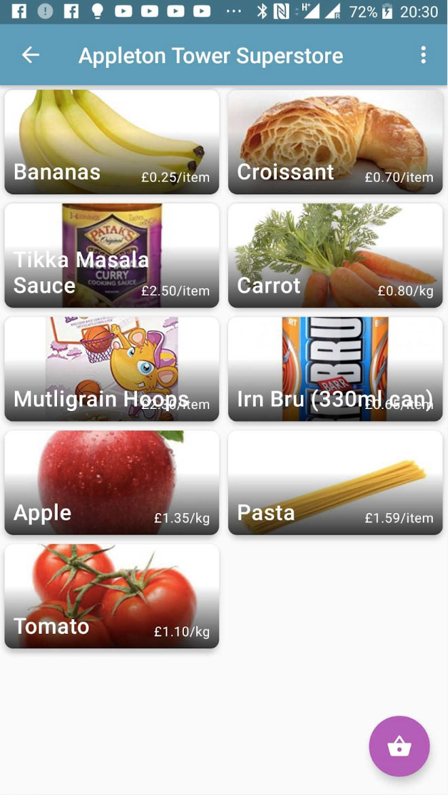
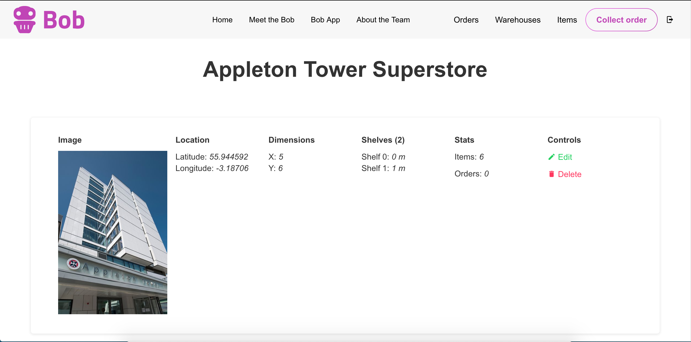
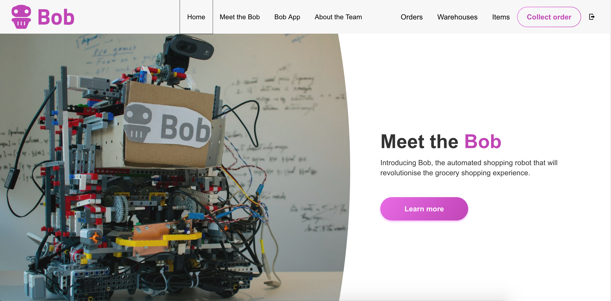

| Branch | Build Status |
|-|-|
| Master |  |
| Beta |  |

Bob is a robotic shopping system build for the System Design Project at the University Of Edinburgh. The Bob system sets out to reduce the amount of time we spend shopping. We often don't have time on their way home to pick up groceries or can't be around for tight delivery windows. Our solution was to create a system that can shop for you, meaning that on your way home you simply need to grab and go! 

Users submit shopping orders from our app, which are then scheduled and collected by our robot. Once ready, the user recieves a QR code in app to verify their order during pick up. We also provide a web dashboard for merchants to manage their stores remotely allowing them to update items, stores and prices. 

The Bob system is made up of serveral components
* Android App
* Vue.js Website
* Node.js Server 
* Lego Mindstorms EV3 & Rasp Pi powered Robot

# The Robot

Tech Used: OpenCV2, Python, EV3Dev

The robot is powered by a Lego Mindstorms EV3 and a Raspberry Pi. This allows the robot to listen for new instructions and perform complex tasks such as lifting, grabbing and tracking its position. 

It has many different sensors that allows it to percieve the world around it. It uses PID line following to move around the shop floor, object regocnition to locate objects on the shelf and many motor controllers to drive the lift, grabber and wheels.

The robot uses an omnidirection base this means that it does not have to turn sharp corners in the warehouse. It uses a scissor lift to push the sweep grabber up to collect items from high shelves.

It communicates with a node.js server to recieve instructions about how to complete orders to provide feedback to the user. 

# The App
*Tech used: Kotlin*

The app is the users interface into the Bob System, a map allows users to browse nearby shops and get directions. For each shop, a list of items is displayed to the user; the user browsers and sumbits an order to the shop. The app then  provides feedback on the order status and finally a verification QR code to show when collecting the items. 

# The Website
*Tech Used: Vue.js, Nuxt.js, Bulma*

The website was created for store/warehouse owners and merchants to manage inventory and orders. It also acts as a marketing instrument towards potential customers or investors. To achieve this the website was separated into two distinct sections - the informative pages are visible to all visitors of the website, while the merchant panel is only accessible to an authenticated user.

The merchant panel includes functionalities for adding, editing, and deleting warehouses, managing items in the warehouses, viewing items and orders related to given warehouses and a qr code scanner intended to authenticate a customer coming to pick-up his order.

# The Server
*Tech used: Node.js, MongoDB*

The server provided multiple roles; first was to manage the shops and their contents; second was to command the robot to collect orders. We used a MongoDB database to store details about shops and items due to its flexibility. It exposes several RESTful endpoints for the robot, website and app to interact with. 

When an order is placed, the server creates a job for the robot; this consists of a series of instructions that are sent to the robot to execute. This uses a simple pathfinding algorithm to create a route between points in the warehouse. 
